# Mermaid Syntax Reference

Mermaid is a JavaScript-based diagramming tool that renders text definitions into diagrams. All definitions begin with a diagram type declaration inside a fenced code block.

````markdown
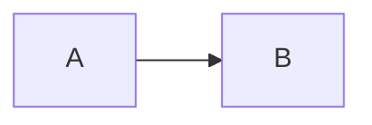
````

Comments use `%%`. Unknown words break diagrams. The word `end` is reserved — wrap it in quotes if needed as a label.

## Diagram Types

| Keyword | Diagram |
|---------|---------|
| `flowchart` or `graph` | Flowchart |
| `sequenceDiagram` | Sequence diagram |
| `classDiagram` | Class diagram |
| `stateDiagram-v2` | State diagram |
| `erDiagram` | Entity relationship diagram |
| `gantt` | Gantt chart |
| `pie` | Pie chart |
| `gitGraph` | Git graph |
| `journey` | User journey map |
| `mindmap` | Mind map |
| `timeline` | Timeline |
| `sankey-beta` | Sankey diagram |
| `xychart-beta` | XY chart |
| `block-beta` | Block diagram |
| `packet-beta` | Packet diagram |
| `kanban` | Kanban board |
| `architecture-beta` | Architecture diagram |

## Flowchart

### Direction

| Keyword | Direction |
|---------|-----------|
| `TB` / `TD` | Top to bottom |
| `BT` | Bottom to top |
| `LR` | Left to right |
| `RL` | Right to left |

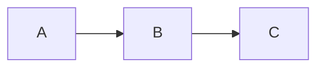

### Node Shapes

| Syntax | Shape |
|--------|-------|
| `id` | Default rectangle |
| `id[text]` | Rectangle with text |
| `id(text)` | Rounded edges |
| `id([text])` | Stadium / pill |
| `id[[text]]` | Subroutine |
| `id[(text)]` | Cylinder / database |
| `id((text))` | Circle |
| `id{text}` | Diamond / decision |
| `id{{text}}` | Hexagon |
| `id[/text/]` | Parallelogram |
| `id[\text\]` | Parallelogram (reversed) |
| `id[/text\]` | Trapezoid |
| `id[\text/]` | Trapezoid (reversed) |
| `id(((text)))` | Double circle |
| `id>text]` | Asymmetric / flag |

### Edge Types

| Syntax | Description |
|--------|-------------|
| `A --> B` | Arrow |
| `A --- B` | Open link (no arrow) |
| `A -.-> B` | Dotted arrow |
| `A ==> B` | Thick arrow |
| `A ~~~ B` | Invisible link |
| `A --o B` | Circle endpoint |
| `A --x B` | Cross endpoint |
| `A <--> B` | Bidirectional arrow |

Text on edges: `A -->|text| B` or `A -- text --> B`

Longer links: add extra dashes `A ----> B`, dots `A -.....-> B`, or equals `A ====> B`.

### Subgraphs

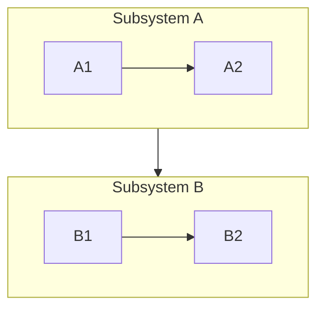

Subgraphs can set their own direction with `direction LR` inside the block. Edges can connect subgraph IDs to nodes.

### Styling

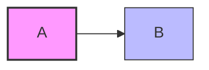

- `classDef name prop:val,prop:val` — define a class
- `class nodeId className` or `nodeId:::className` — apply a class
- `style nodeId prop:val` — inline style on a single node
- `linkStyle 0 stroke:#ff3,stroke-width:4px` — style edge by index (0-based)

## Sequence Diagram

### Participants

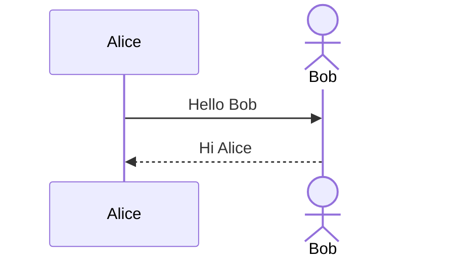

`participant` draws a box, `actor` draws a stick figure. Participants render in declaration order.

### Message Arrows

| Syntax | Description |
|--------|-------------|
| `->` | Solid line, no arrowhead |
| `-->` | Dashed line, no arrowhead |
| `->>` | Solid line with arrowhead |
| `-->>` | Dashed line with arrowhead |
| `-x` | Solid line with cross |
| `--x` | Dashed line with cross |
| `-)` | Solid line with open arrow (async) |
| `--)` | Dashed line with open arrow (async) |

### Activations

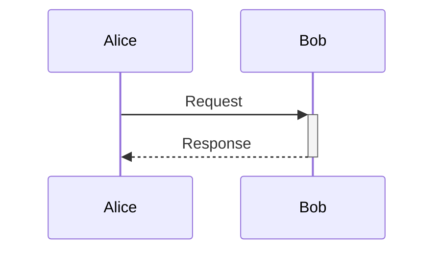

Use `+` after arrow to activate, `-` to deactivate. Or use explicit `activate`/`deactivate` keywords. Activations can nest (stack).

### Notes

```
Note right of Alice: Single participant
Note over Alice,Bob: Spanning note
Note left of Bob: Left side
```

### Control Flow

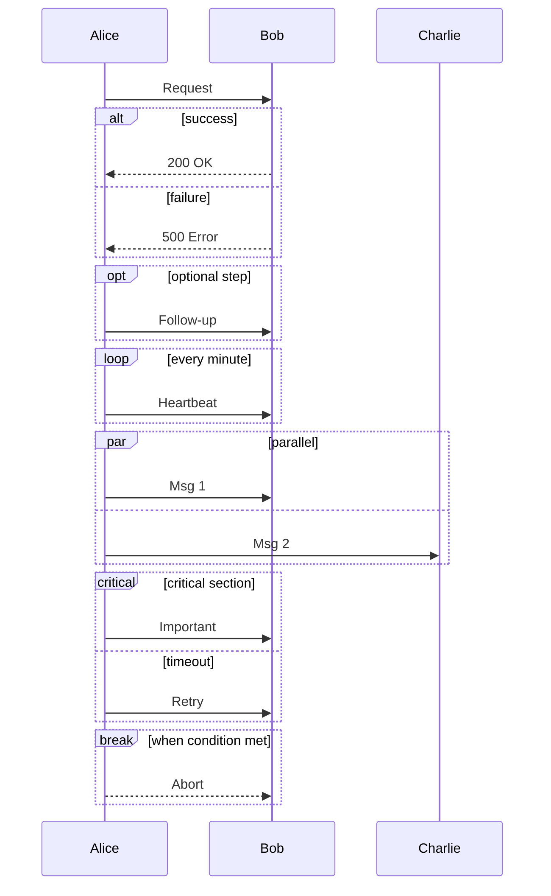

### Other Features

- `autonumber` — auto-number messages
- `create participant C` — create mid-diagram
- `destroy C` — remove participant
- `box rgba(100,100,100,0.1) Group Name` ... `end` — visual grouping
- `rect rgb(200,200,200)` ... `end` — background highlight
- `<br/>` — line break in messages/notes

## Class Diagram

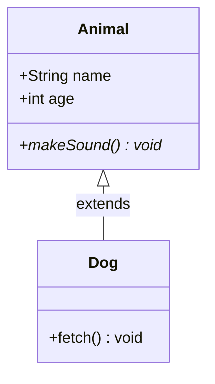

### Visibility

| Symbol | Meaning |
|--------|---------|
| `+` | Public |
| `-` | Private |
| `#` | Protected |
| `~` | Package/Internal |

### Method Classifiers

- `*` after `()` — abstract
- `$` after `()` — static

### Relationships

| Syntax | Type |
|--------|------|
| `A <\|-- B` | Inheritance |
| `A *-- B` | Composition |
| `A o-- B` | Aggregation |
| `A --> B` | Association |
| `A -- B` | Solid link |
| `A ..> B` | Dependency |
| `A ..\|> B` | Realization |
| `A .. B` | Dashed link |

Labels: `A <|-- B : implements`

Cardinality: `A "1" --> "*" B`

### Annotations

```
class Shape {
    <<Interface>>
}
class Color {
    <<Enumeration>>
    RED
    GREEN
    BLUE
}
```

### Namespaces

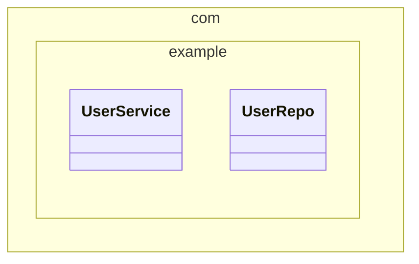

### Direction

`direction RL` at the top of the diagram. Supports `TB`, `BT`, `LR`, `RL`.

## State Diagram

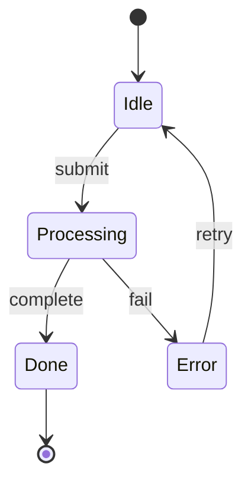

- `[*]` — start state (when target) or end state (when source)
- `s1 --> s2 : label` — transition with label
- `state "Description" as s1` — state with description
- `s1 : Description` — alternative description syntax

### Composite States

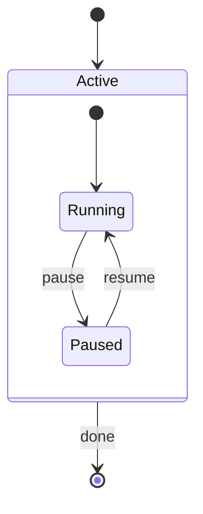

### Fork / Join (Concurrency)

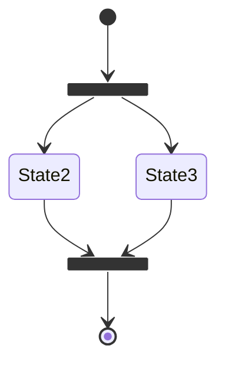

### Choice (Conditional)

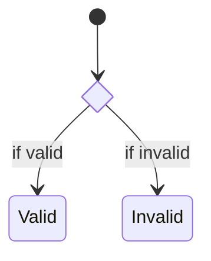

### Concurrency (Parallel Regions)

```
state Active {
    [*] --> A
    --
    [*] --> B
}
```

The `--` separator creates parallel regions within a composite state.

### Notes

```
note right of State1 : explanation
note left of State2
    Multi-line
    note text
end note
```

### Styling

```
classDef highlight fill:#f00,color:#fff
class State1 highlight
```

Or inline: `State1:::highlight`

## Entity Relationship Diagram

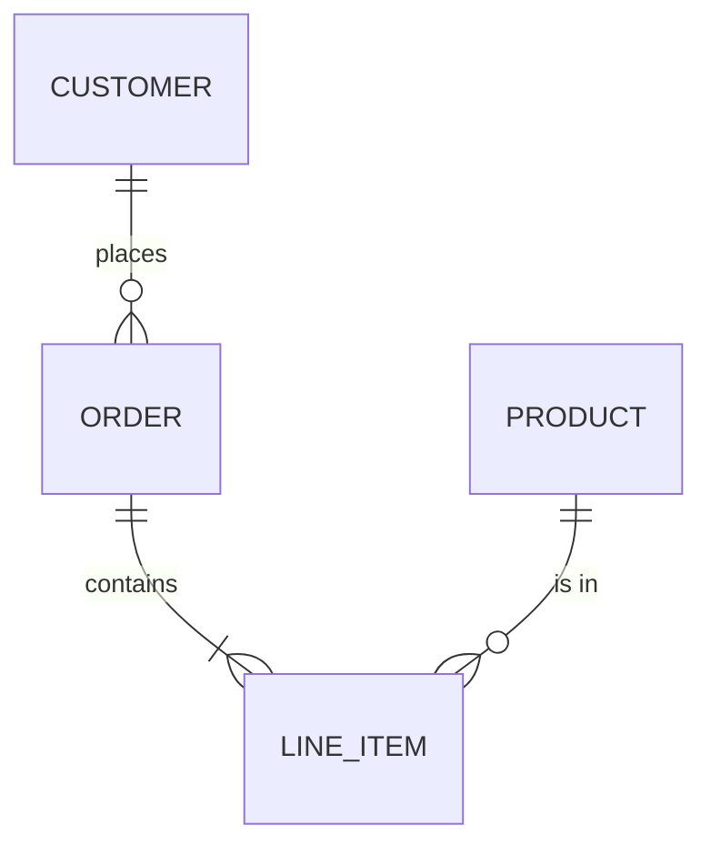

### Cardinality (Crow's Foot)

| Notation | Meaning |
|----------|---------|
| `\|o` | Zero or one |
| `\|\|` | Exactly one |
| `}o` | Zero or more (many) |
| `}\|` | One or more |

Left side is first entity's cardinality, right side is second entity's.

### Relationship Lines

- `--` — identifying (solid line)
- `..` — non-identifying (dashed line)

### Attributes

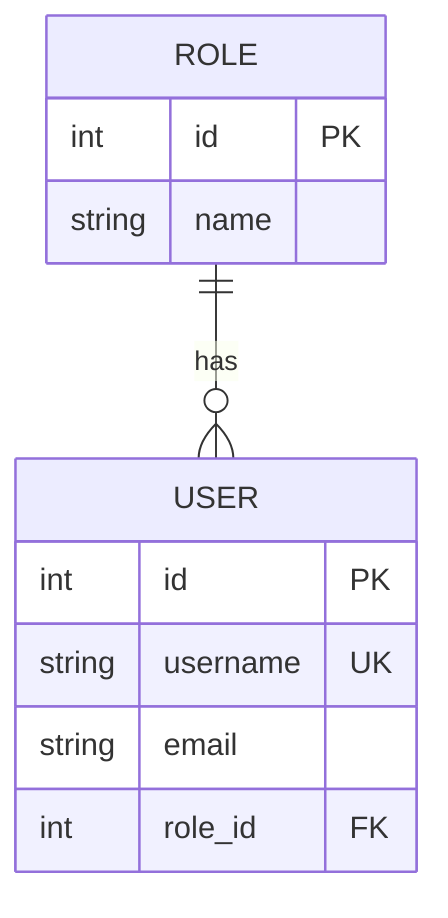

Format: `type name [PK|FK|UK] ["comment"]`

### Direction

`direction LR` or `direction TB` etc. at the start.

## Gantt Chart

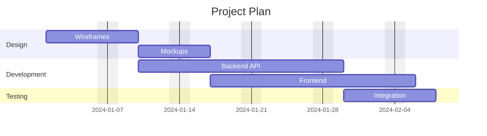

### Task Syntax

```
taskName :id, startDate, duration
taskName :id, after otherId, duration
taskName :active, 2024-01-01, 3d
taskName :done, 2024-01-01, 2d
taskName :crit, 2024-01-10, 5d
taskName :milestone, 2024-01-15, 0d
```

Tags: `done`, `active`, `crit` (critical), `milestone`. Combine: `crit, active, 2024-01-01, 3d`.

### Date Formats

`dateFormat YYYY-MM-DD` — set input format. Supports moment.js tokens.

`axisFormat %Y-%m` — set axis display format (d3 time format).

`tickInterval 1week` — control axis tick spacing.

### Excludes

```
excludes weekends
excludes 2024-12-25, 2024-01-01
```

## Pie Chart

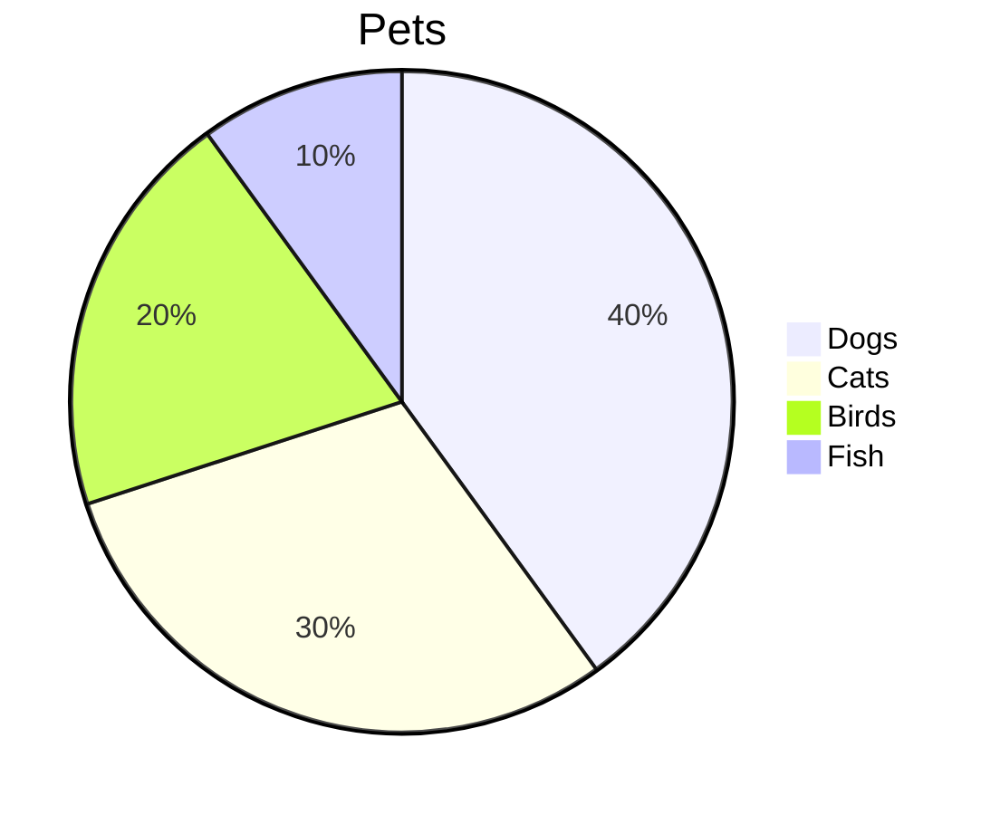

Optional `showData` after `pie` to display values.

## Git Graph

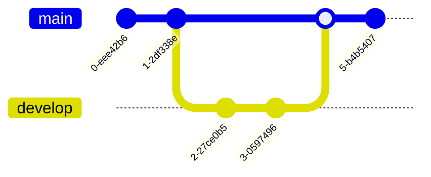

### Commands

| Command | Description |
|---------|-------------|
| `commit` | Add a commit |
| `commit id: "msg"` | Commit with label |
| `commit tag: "v1.0"` | Commit with tag |
| `commit type: HIGHLIGHT` | Types: `NORMAL`, `REVERSE`, `HIGHLIGHT` |
| `branch name` | Create branch |
| `checkout name` | Switch to branch |
| `merge name` | Merge branch into current |
| `cherry-pick id: "abc"` | Cherry-pick a commit |

## User Journey

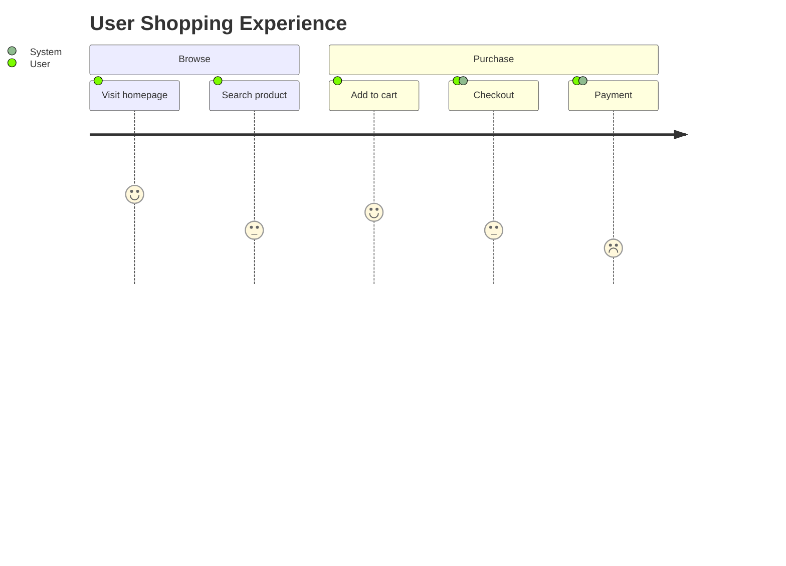

Format: `task name: satisfaction(1-5): actors`

## Mindmap

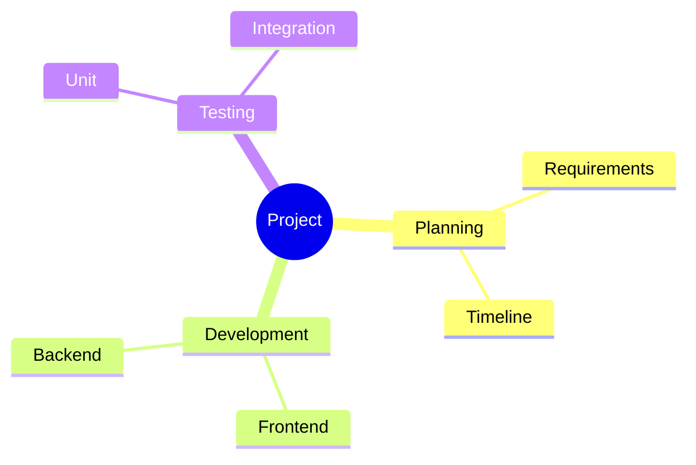

Node shapes: `(round)`, `[square]`, `((circle))`, `)cloud(`, `{{hexagon}}`. Indentation defines hierarchy.

## Timeline

```mermaid
timeline
    title History
    2020 : Event A : Event B
    2021 : Event C
    2022 : Event D : Event E : Event F
```

Sections group periods: `section Phase Name` before time entries.

## XY Chart

```mermaid
xychart-beta
    title "Sales"
    x-axis [Jan, Feb, Mar, Apr, May]
    y-axis "Revenue" 0 --> 100
    bar [10, 30, 50, 40, 60]
    line [10, 30, 50, 40, 60]
```

## Configuration

### Frontmatter

```mermaid
---
title: My Diagram
config:
    theme: forest
---
flowchart LR
    A --> B
```

### Directives

```
%%{init: {"theme": "dark"}}%%
flowchart LR
    A --> B
```

### Themes

| Theme | Description |
|-------|-------------|
| `default` | Standard colors |
| `dark` | Dark background |
| `forest` | Green palette |
| `neutral` | Grayscale |
| `base` | Minimal, for customization |

### Theme Variables

Override via `themeVariables` in init:

```
%%{init: {"theme": "base", "themeVariables": {"primaryColor": "#ff0000"}}}%%
```

Common variables: `primaryColor`, `primaryTextColor`, `primaryBorderColor`, `lineColor`, `secondaryColor`, `tertiaryColor`, `fontSize`.

## Common Patterns

### Flowchart with Decision

```mermaid
flowchart TD
    Start([Start]) --> Input[/Get input/]
    Input --> Check{Valid?}
    Check -->|Yes| Process[Process data]
    Check -->|No| Error[Show error]
    Error --> Input
    Process --> Done([End])
```

### Service Architecture

```mermaid
flowchart LR
    Client --> LB[Load Balancer]
    LB --> API1[API Server 1]
    LB --> API2[API Server 2]
    API1 --> DB[(Database)]
    API2 --> DB
    API1 --> Cache[(Redis)]
    API2 --> Cache
```

### API Sequence

```mermaid
sequenceDiagram
    participant C as Client
    participant G as API Gateway
    participant S as Service
    participant D as Database

    C ->>+ G: POST /api/resource
    G ->>+ S: Forward request
    S ->>+ D: INSERT
    D -->>- S: OK
    S -->>- G: 201 Created
    G -->>- C: 201 Created
```

### State Machine

```mermaid
stateDiagram-v2
    [*] --> Draft
    Draft --> Review : submit
    Review --> Approved : approve
    Review --> Draft : reject
    Approved --> Published : publish
    Published --> Archived : archive
    Archived --> [*]
```

### Data Model

```mermaid
erDiagram
    USER ||--o{ POST : writes
    USER ||--o{ COMMENT : writes
    POST ||--o{ COMMENT : has
    POST }o--|| CATEGORY : "belongs to"
```
