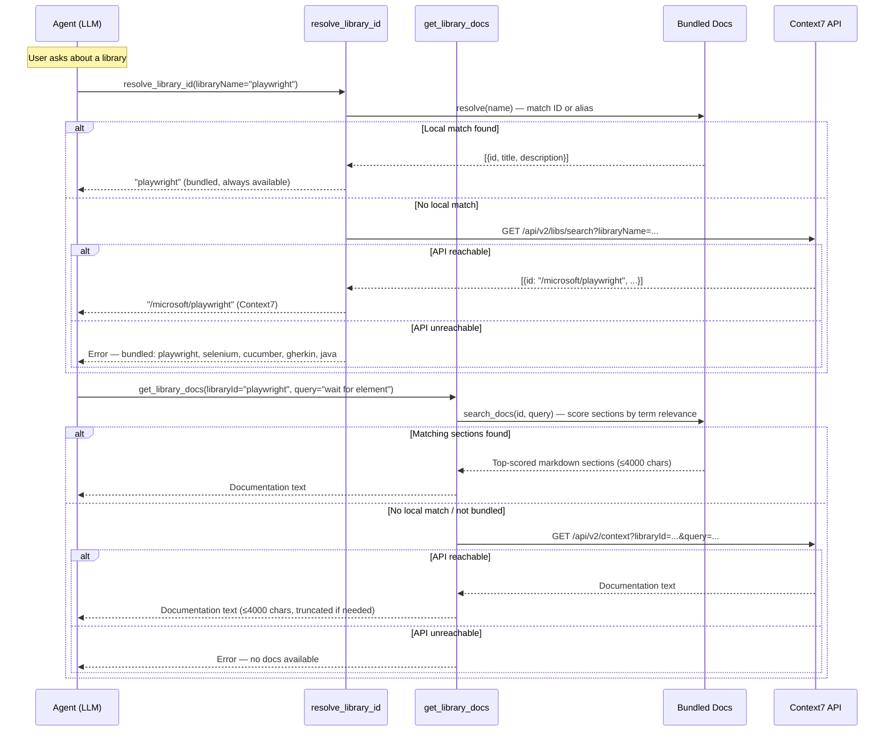
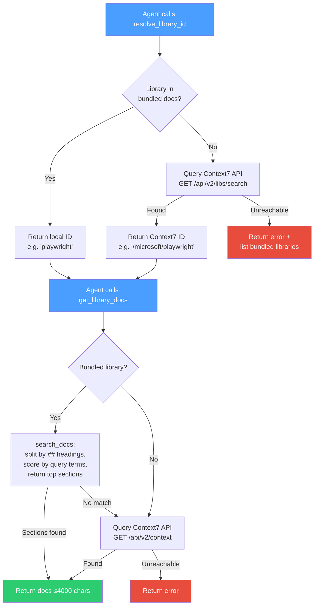

# Implementing Custom Tools for the Copilot Language Server

This document is a complete guide for adding new client-side tools to the Copilot language server integration. It covers the protocol, response format, project conventions, and how to test.

## Project Structure

```
copilot_client.py              # Main client — handles JSON-RPC, dispatches tool calls
tools/
  __init__.py                  # Auto-discovers all tool modules, exports TOOL_SCHEMAS/TOOL_EXECUTORS
  _base.py                    # ToolContext dataclass shared by all tools
  read_file.py                # One file per tool (15 built-in + 7 custom)
  list_dir.py
  get_changed_files.py         # Example custom tool
  memory.py                    # Example custom tool
  ...
tests/
  test_tools.py                # Unit tests for all tools
```

**Auto-discovery**: `tools/__init__.py` scans for every `.py` file in `tools/` that has both a `SCHEMA` dict and an `execute` function. No manual imports or registration lists needed — just drop a file in `tools/` and it works.

## ToolContext — What Your Tool Receives

Every tool's `execute()` function receives a `ToolContext` with these fields:

```python
@dataclasses.dataclass
class ToolContext:
    workspace_root: str                              # Absolute path to the user's project
    sync_file_to_server: Callable[[str, str], None]  # Call after writing a file: (path, content)
    open_document: Callable[[str, str, str], None]    # Open a file in the editor: (uri, lang, text)
```

- **`workspace_root`**: Use this as the base directory for file operations, searches, and git commands. Never hardcode paths.
- **`sync_file_to_server`**: Call this after your tool creates or modifies a file, so the server knows about the change.
- **`open_document`**: Rarely needed. Only use if your tool should open a file in the editor.

## How to Add a New Tool

### Step 1: Create the tool file

Create `tools/your_tool_name.py` with two exports: `SCHEMA` and `execute`.

```python
# tools/your_tool_name.py
"""One-line description of what this tool does."""

import os
from tools._base import ToolContext

SCHEMA = {
    "name": "your_tool_name",
    "description": "Clear description of what this tool does. The LLM reads this to decide when to call it.",
    "inputSchema": {
        "type": "object",
        "properties": {
            "param1": {
                "type": "string",
                "description": "What this parameter is for. The LLM reads this too.",
            },
            "optionalParam": {
                "type": "string",
                "description": "An optional parameter.",
            },
        },
        "required": ["param1"],  # MUST be present, even if empty: []
    },
}


def execute(tool_input: dict, ctx: ToolContext) -> list:
    param1 = tool_input.get("param1", "")
    optional = tool_input.get("optionalParam", "default_value")

    # Do your work here using ctx.workspace_root as the base directory
    result_text = f"Processed {param1}"

    # Return a list of content parts
    return [{"type": "text", "value": result_text}]
```

That's it. The tool is automatically discovered and registered on the next run.

### Step 2: Understand the return conventions

Tools return results in one of two formats:

| Format | When to use | Example |
|--------|-------------|---------|
| `list` | Read-only tools that return text output | `[{"type": "text", "value": "output"}]` |
| `dict` | Tools that mutate files | `{"result": "success"}` or `{"result": "error", "message": "..."}` |

**If your tool writes files**, call `ctx.sync_file_to_server(path, content)` after writing:

```python
def execute(tool_input: dict, ctx: ToolContext) -> dict:
    path = tool_input.get("filePath", "")
    content = tool_input.get("content", "")
    with open(path, "w") as f:
        f.write(content)
    ctx.sync_file_to_server(path, content)
    return {"result": "success"}
```

**If your tool reads/searches**, return a list with text:

```python
def execute(tool_input: dict, ctx: ToolContext) -> list:
    # ... search or read ...
    return [{"type": "text", "value": "the output text"}]
```

You don't need to worry about the wire format — `copilot_client.py` wraps your result automatically.

### Step 3: Test it

Run unit tests:
```bash
python3 -m pytest tests/test_tools.py -v
```

Run end-to-end with the Copilot server:
```bash
python3 copilot_client.py -w /path/to/workspace agent "Use your_tool_name with param1 set to 'test'"
```

## Real-World Tool Examples

### Example 1: Read-only tool (git status)

```python
# tools/get_changed_files.py
"""Get list of changed files from git status/diff."""

import subprocess
from tools._base import ToolContext

SCHEMA = {
    "name": "get_changed_files",
    "description": "Get the list of changed, staged, or untracked files from git.",
    "inputSchema": {
        "type": "object",
        "properties": {
            "repositoryPath": {
                "type": "string",
                "description": "Path to the git repository. Defaults to workspace root.",
            },
            "sourceControlState": {
                "type": "string",
                "description": "Filter by state: 'all' (default), 'staged', 'unstaged', 'untracked'.",
            },
        },
        "required": [],
    },
}


def execute(tool_input: dict, ctx: ToolContext) -> list:
    repo_path = tool_input.get("repositoryPath", ctx.workspace_root)
    state = tool_input.get("sourceControlState", "all")
    results = []

    if state in ("all", "staged"):
        r = subprocess.run(
            ["git", "diff", "--name-only", "--cached"],
            capture_output=True, text=True, timeout=15, cwd=repo_path,
        )
        if r.stdout.strip():
            results.append(f"## Staged files\n{r.stdout.strip()}")

    if state in ("all", "unstaged"):
        r = subprocess.run(
            ["git", "diff", "--name-only"],
            capture_output=True, text=True, timeout=15, cwd=repo_path,
        )
        if r.stdout.strip():
            results.append(f"## Unstaged changes\n{r.stdout.strip()}")

    if state in ("all", "untracked"):
        r = subprocess.run(
            ["git", "ls-files", "--others", "--exclude-standard"],
            capture_output=True, text=True, timeout=15, cwd=repo_path,
        )
        if r.stdout.strip():
            results.append(f"## Untracked files\n{r.stdout.strip()}")

    output = "\n\n".join(results) if results else "No changed files found."
    return [{"type": "text", "value": output}]
```

### Example 2: Stateful tool (persistent memory)

```python
# tools/memory.py
"""Persistent memory store for the agent — save/read/list/delete notes."""

import os
from tools._base import ToolContext

_MEMORY_DIR = os.path.expanduser("~/.copilot-cli/memories")

SCHEMA = {
    "name": "memory",
    "description": "Persistent memory store. Save, read, list, or delete named memory files.",
    "inputSchema": {
        "type": "object",
        "properties": {
            "command": {
                "type": "string",
                "enum": ["save", "read", "list", "delete"],
                "description": "The operation to perform.",
            },
            "path": {
                "type": "string",
                "description": "Memory file name (e.g. 'notes.md'). Required for save/read/delete.",
            },
            "content": {
                "type": "string",
                "description": "Content to save. Required for 'save'.",
            },
        },
        "required": ["command"],
    },
}


def execute(tool_input: dict, ctx: ToolContext) -> list:
    command = tool_input.get("command", "")
    path = tool_input.get("path", "")
    content = tool_input.get("content", "")
    os.makedirs(_MEMORY_DIR, exist_ok=True)

    if command == "list":
        entries = [f for f in sorted(os.listdir(_MEMORY_DIR))
                   if os.path.isfile(os.path.join(_MEMORY_DIR, f))]
        listing = "\n".join(entries) if entries else "No memories saved yet."
        return [{"type": "text", "value": listing}]

    if not path:
        return [{"type": "text", "value": "Error: 'path' is required for save/read/delete."}]

    safe_name = os.path.basename(path)  # prevent directory traversal
    full_path = os.path.join(_MEMORY_DIR, safe_name)

    if command == "save":
        with open(full_path, "w") as f:
            f.write(content)
        return [{"type": "text", "value": f"Saved memory '{safe_name}'."}]
    elif command == "read":
        if not os.path.exists(full_path):
            return [{"type": "text", "value": f"Memory '{safe_name}' not found."}]
        with open(full_path, "r") as f:
            return [{"type": "text", "value": f.read()}]
    elif command == "delete":
        if os.path.exists(full_path):
            os.remove(full_path)
            return [{"type": "text", "value": f"Deleted memory '{safe_name}'."}]
        return [{"type": "text", "value": f"Memory '{safe_name}' not found."}]

    return [{"type": "text", "value": f"Unknown command: {command}"}]
```

## Schema Rules

1. **`required` must always be present** in `inputSchema`, even as an empty list `[]`. The server rejects registration if this field is missing.

2. **`name` in SCHEMA must match the file's tool name.** The auto-discovery uses `SCHEMA["name"]` as the key.

3. **Descriptions are prompts.** The LLM decides whether and how to call your tool based on `description` and each property's `description`. Be specific: "Get the list of changed, staged, or untracked files from git" is better than "Git helper tool."

4. **Use `enum` for constrained values.** If a parameter only accepts specific values (like `"save"`, `"read"`, `"list"`), use `"enum": [...]` so the LLM knows the valid options.

## Built-in vs Custom Tool Protocol (How the Wire Format Works)

You don't need to know this to add tools — `copilot_client.py` handles it — but it explains why things are the way they are.

The Copilot server has two tool types with **different response formats**:

### Built-in tools (15 tools)

These are hardcoded in the server. When the server calls them and receives the JSON-RPC response, it processes the `result` field directly.

```json
{"jsonrpc": "2.0", "id": 42, "result": [{"type": "text", "value": "output"}]}
```

### Registered (custom) tools

When the server calls a registered tool, its `AgentClientToolInvoker` destructures the response as a **two-element tuple**:

```javascript
// copilot-agent/dist/main.js — AgentClientToolInvoker
let c = await o.sendRequest(this.requestType, n), [l, u] = c;
//                                                 ↑result  ↑error
if (u) { throw ... }
if (!this.typeCheck.Check(l)) throw ...  // validates against compiled schema
return this.transformToToolResult(l);

// transformToToolResult expects:
//   l.content  → array of {value: string}
//   l.status   → "success" or "error"
```

So the JSON-RPC response must be:

```json
{
  "jsonrpc": "2.0",
  "id": 42,
  "result": [
    {"content": [{"value": "output text"}], "status": "success"},
    null
  ]
}
```

`copilot_client.py` does this wrapping automatically in `_wrap_registered_tool_result()`. Your `execute()` function just returns the simple list/dict format and the wrapping is applied for any tool not in `BUILTIN_TOOL_NAMES`.

### What breaks and why

| Response format | Result |
|----------------|--------|
| `[{content: [{value: "..."}], status: "success"}, null]` | Works |
| `{content: [{value: "..."}], status: "success"}` | Fails — not a tuple, JS can't destructure |
| `[{type: "text", value: "..."}]` | Fails — has no `content` field, type check rejects it |
| `{content: "text", status: "success"}` | Fails — `content` isn't an array, `.map()` throws |

All failures are **silent** — the LLM just says "there was an issue" with zero diagnostic info.

### Do NOT re-register built-in tools

If you register a tool with a built-in name (e.g. `read_file`), the server reclassifies it from `type: "shared"` to `type: "client"`. It then expects the tuple response format, but your executor still returns the built-in format. Everything breaks.

The 15 built-in tool names (server v1.420.0):
```
insert_edit_into_file, replace_string_in_file, multi_replace_string,
create_file, create_directory, apply_patch, read_file, list_dir,
file_search, grep_search, find_test_files, run_in_terminal,
run_tests, fetch_web_page, get_errors
```

## Tool Confirmation

The server may send `conversation/invokeClientToolConfirmation` before calling a tool. Respond to accept:

```json
{"result": [{"result": "accept"}, null]}
```

This is skipped when `agentMode.autoApproval.enabled` is `true`.

## Checklist for Adding a New Tool

- [ ] Create `tools/your_tool_name.py` with `SCHEMA` dict and `execute(tool_input, ctx)` function
- [ ] `SCHEMA` has `name`, `description`, and `inputSchema` with `required` field
- [ ] `SCHEMA["name"]` is not one of the 15 built-in names
- [ ] `execute()` returns `list` (for read ops) or `dict` (for write ops)
- [ ] If writing files, call `ctx.sync_file_to_server(path, content)` after
- [ ] Use `ctx.workspace_root` as base directory, never hardcode paths
- [ ] Add a test in `tests/test_tools.py`
- [ ] Run `python3 -m pytest tests/test_tools.py -v`
- [ ] Test e2e: `python3 copilot_client.py -w /path/to/workspace agent "Use your_tool_name ..."`

## Library Docs Tool — Two-Step Lookup

The library documentation system uses a two-step pattern: first resolve the library name to an ID, then fetch docs using that ID. Both steps try local bundled docs before falling back to the Context7 API.

### Flow Diagram



### Architecture Diagram



### Bundled Libraries

| ID | Aliases | Docs Path |
|---|---|---|
| `playwright` | playwright-java, microsoft/playwright, pw | `library_docs/playwright/` |
| `selenium` | selenium-java, seleniumhq, webdriver | `library_docs/selenium/` |
| `cucumber` | cucumber-java, cucumber-jvm, cucumber-junit | `library_docs/cucumber/` |
| `gherkin` | feature-file, bdd, given-when-then | `library_docs/gherkin/` |
| `java` | java-se, jdk, java-api, java-lang | `library_docs/java/` |

### Local Search Algorithm

`search_docs()` in `library_docs/__init__.py`:

1. Load all `.md` files from the library's docs directory
2. Split each file into sections at `## ` headings
3. Score each section by counting query term occurrences (+2 bonus if term appears in heading)
4. Return top 8 sections by score, capped at `max_chars` (default 4000)
5. If no terms match, return first 5 sections as an overview
